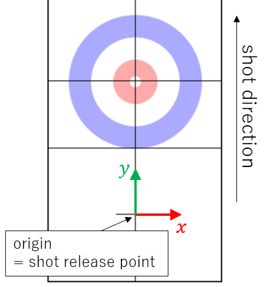
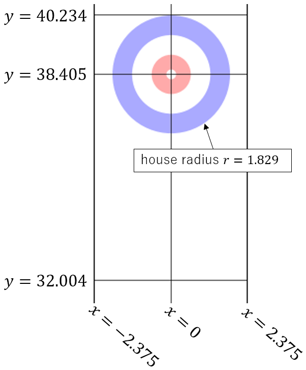
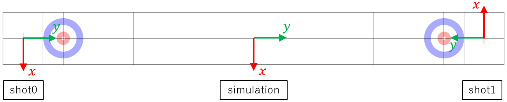

# 座標系

## 思考エンジンにとっての座標系

座標系の単位はメートルです．

サーバーから送信されるストーンの配置は，ハックの位置(=ストーンの発射位置)を原点，シートの長辺方向をy軸とする座標系上のものです．

プレイエリアの座標は次の図の通りです．

\note
シートの横幅はサーバーのコンフィグで変更することができます．図の値は横幅4.75mの場合の値です．
シートの横幅を変更した場合もセンターラインは必ず x=0 になります．

## 座標系の詳細

この項目はライブラリ/ツール開発者向けです．

物理シミュレーション上ではエンド毎にショットの発射位置と方向を逆サイドに入れ替えています．
これは氷面の局所的な変化に対応したシミュレータを作るための布石です．
ただ，思考エンジン開発者にとってはエンドの度にプレイエリアの座標が変化すると不便であるため，ストーンの発射地点を原点とする座標系に変換することで見かけ上のプレイエリアの座標を一定にしています．

内部的には座標系は3種類あります．

名前 | enum | 説明
-----|------|--------------
シミュレーション座標系 | [coordinate::Id::kSimulation](@ref digitalcurling3::coordinate::Id::kSimulation) | 物理シミュレーションを行う座標系．[ISimulator](@ref digitalcurling3::ISimulator)への入出力はこの座標系で行う．
ショット座標系0 | [coordinate::Id::kShot0](@ref digitalcurling3::coordinate::Id::kShot0) | 偶数エンドで思考エンジンに送信される座標はこの座標系上のものです
ショット座標系1 | [coordinate::Id::kShot1](@ref digitalcurling3::coordinate::Id::kShot1) | 奇数エンドで思考エンジンに送信される座標はこの座標系上のものです

各座標系の原点と座標軸の方向は次の図の通りです．

それぞれの座標系間の座標変換は[名前空間coordinate](@ref digitalcurling3::coordinate)内の関数で行うことができます．

